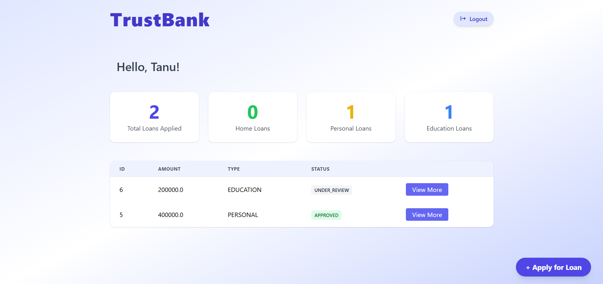
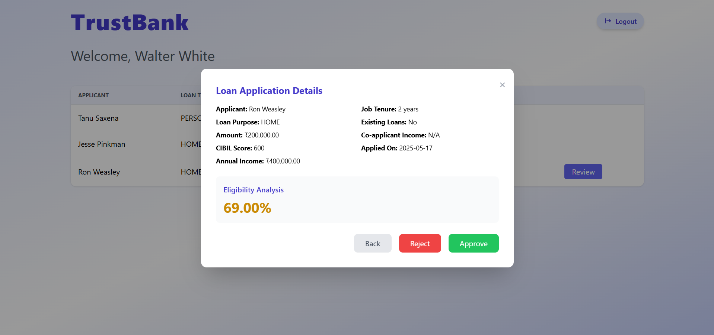
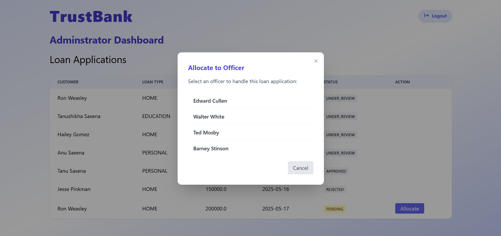

# Loan Management System

A full-stack web application for managing loan applications, review, and approval workflows. Built with **Spring Boot**, **Thymeleaf**, and **PostgreSQL**.

---

## 🚀 Features

- **User Registration & Login** (Customer, Officer, Admin roles)
- **Customer Dashboard:** Apply for loans, track application status, withdraw applications
- **Officer Dashboard:** Review assigned loans, check eligibility, approve/reject applications
- **Admin Dashboard:** View all loans, allocate loans to officers
- **Loan Eligibility Calculation** (customizable logic)
- **Role-based access control** with Spring Security
- **Form validation** with user-friendly error messages
- **Responsive UI** using Tailwind CSS

---

## 🖥️ Screenshots

| Customer Apply Form | Officer Dashboard | Loan Review Modal |
|---------------------|------------------|------------------|
|  |  |  |

---

## 🛠️ Tech Stack

- **Backend:** Spring Boot, Spring Security, Spring Data JPA
- **Frontend:** Thymeleaf, Tailwind CSS
- **Database:** PostgreSQL
- **Build:** Maven

---

## ⚡ Getting Started

### 1. Clone the repository

git clone https://github.com/tanushikhasaxena/Loan-Manager.git
cd Loan-Manager

text

### 2. Configure the Database

- Create a PostgreSQL database (e.g., `loan_management`).
- Copy `application-example.properties` to `application.properties` and set your DB credentials:

spring.datasource.url=jdbc:postgresql://localhost:5432/loan_management
spring.datasource.username=your_db_user
spring.datasource.password=your_db_password
spring.jpa.hibernate.ddl-auto=update

text

### 3. Build and Run

./mvnw spring-boot:run

text

or

mvn spring-boot:run

text

### 4. Access the App

- Visit [http://localhost:8080](http://localhost:8080) in your browser.

---

## 👤 Default Roles

- **Customer:** Can apply for and track loans.
- **Officer:** Can review, approve, or reject assigned loans.
- **Admin:** Can allocate loans, view all users and loans.

---

## 📝 Contributing

Pull requests are welcome! For major changes, please open an issue first to discuss what you would like to change.

---

## 📄 License

[MIT](LICENSE)

---

## 🙏 Acknowledgements

- [Spring Boot](https://spring.io/projects/spring-boot)
- [Thymeleaf](https://www.thymeleaf.org/)
- [Tailwind CSS](https://tailwindcss.com/)
- [PostgreSQL](https://www.postgresql.org/)

---

## Screenshots
WELCOME PAGE

REGISTRATION PAGE

LOGIN PAGE

> **Made with ❤️ by [Tanushikha Saxena](https://github.com/tanushikhasaxena)**
